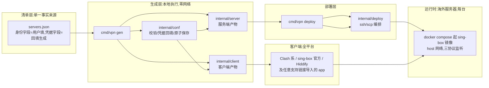

# vpn:自建代理方案(从 0 到 1 完整闭环)

一套自建 VPN(代理)方案:sing-box 服务端 + 多客户端配置生成。
填写一份服务器清单,本地一条命令生成全部产物,再一条命令把服务端部署到海外服务器;
任意设备用主流客户端(sing-box 官方 / Hiddify / Clash Verge Rev / mihomo 等)导入即用。

> 定位:个人/小团队自用,极简无面板,清单驱动,服务端无状态。
> 不做什么:不做多用户面板、不做流量统计、不维护在线订阅服务。

---

## 1 快速开始(5 步)

```bash
# 1. 环境准备(Go 1.27+ / ssh / scp;macOS/Linux/Windows 均可)
make doctor

# 2. 填写服务器清单(复制示例后编辑 address 等字段)
cp example-servers.json servers.json
#   字段说明见 docs/deployment.md 第 3 步

# 3. 本地生成全部产物(自动回填密钥并写回清单,幂等)
make gen

# 4. 一条命令部署到全部服务器(需已配置免密 SSH;自动装 Docker、放行防火墙、启动并验证)
make deploy

# 5. 客户端导入
#    Clash Verge Rev 等 Clash 系  : 导入 dist/clash.yaml
#    sing-box 官方(SFI/SFA/CLI)  : 导入 dist/sing-box.json
#    手机(任意支持链接的 app)     : 扫码/粘贴 dist/links.txt 里的链接
#    详细对接见 docs/clients.md
```

完整部署指导(买服务器、SSH 密钥、云安全组等)见 [docs/deployment.md](docs/deployment.md)。

## 2 架构与设计

### 2.1 架构总览



### 2.2 模块职责

| 包 | 职责 |
|---|---|
| `cmd/vpn` | CLI 编排:gen(生成全部产物)/ deploy(远程部署)/ doctor(环境自检);产物写盘与权限 |
| `internal/conf` | 清单模型、校验、凭据回填、原子保存、节点反推(唯一被多方引用的包,凭据单一来源) |
| `internal/server` | 服务端 sing-box 配置渲染 + docker-compose/deploy.sh/cert.sh |
| `internal/client` | 客户端产物渲染:分享链接、base64 订阅、clash.yaml、sing-box.json |
| `internal/deploy` | ssh/scp 逐台上传与远程执行 |

### 2.3 设计决策(为什么这样做)

| 决策 | 理由 |
|---|---|
| 服务端用 sing-box 官方镜像 | 单容器支持全部三协议;与主流客户端同源(官方客户端/Hiddify 基于 sing-box,Clash 系完整支持);相对 xray 面板(3x-ui 等)无数据库/无 Web 面,攻击面小、无状态、迁移简单;镜像锁 tag 升级可控 |
| 三协议通道(Reality + SS + Hy2) | 兼容矩阵推导:VLESS+Reality 是 2024 年后 Clash 系/Hiddify/sing-box/iOS 新版 app 的主通道(抗封锁、无证书);SS 最老牌,一切客户端保底;Hy2 走 QUIC,加速与逃生。三通道即可覆盖全部目标客户端,VMess/Trojan+WS 等需域名证书,个人自用收益低不做(清单模型留扩展位) |
| 本地生成静态产物,不要面板/在线订阅 | 清单文件即"填写服务器信息"的载体,生成即分发;静态产物零运行时依赖,服务器可随时销毁重建;无订阅则无过期/鉴权/托管问题。未来要在线订阅,把 `sub.txt` 托管到任意静态 URL 即完成 |
| 生成器零第三方依赖(纯标准库) | 配置均为固定结构文本,模板渲染足够;不引入 sing-box option 库(旧方案重依赖、构建标签、分钟级编译,本方案构建秒级)。正确性由"模板 + 渲染后 json.Valid 校验 + 一致性单测 + 服务器上 docker run check 最终把关"保证 |
| 凭据只在本地生成回填(服务端无状态) | Reality 密钥/UUID/SS/Hy2 密码全部在 `make gen` 时生成写回清单(0600 原子写,严格模式解析防拼错);服务器只消费静态 config.json。服务器可任意重建,凭据不变则已分发客户端免更新;服务端/客户端产物从同一清单渲染,凭据不可能漂移(单测黄金断言守护) |
| 分流规则按客户端形态取舍 | clash.yaml 内置国内直连(GEOSITE,cn / GEOIP,CN),Clash 系自带 geodata 开箱可用;sing-box.json 用全局代理 + 内网直连(不依赖外置规则文件,官方 app 导入即用),需要国内分流的按文档追加 |

### 2.4 安全模型

- 本地:清单与全部含凭据产物 0600;凭据不进 git(`servers.json` 已忽略)
- 传输:凭据即认证(Reality 公钥体系 / SS 密码 / Hy2 密码);Reality 流量伪装为 TLS 访问公开站点
- 服务器:仅暴露监听端口,无面板无多余服务面;容器只读挂载配置
- 部署链路:SSH 非交互(BatchMode)、首次指纹 accept-new、超时保护、错误即停;脚本内嵌值经校验与 shell 转义双重防注入
- H2 证书:默认自签(insecure 跳过校验);要受信证书时清单声明 `server_name` 并自行放置(消除自签的中间人风险面)

### 2.5 扩展方向(需要时再加)

- 新增协议通道:conf 通道结构 + server 片段 + client 渲染分支同构扩展(如 VMess+WS+TLS,需域名证书)
- 在线订阅更新:托管 `sub.txt` 到任意静态 URL,无需本仓库代码
- 多用户:清单按用户拆多份分别 gen,不做面板

## 3 平台与客户端生态

### 3.1 平台 × 客户端总表

| 平台 | 推荐客户端 | 使用产物 | 备选 |
|---|---|---|---|
| Windows | Clash Verge Rev | clash.yaml | Hiddify / sing-box CLI |
| macOS | Clash Verge Rev | clash.yaml | Hiddify / sing-box(SFI) |
| Linux 桌面 | Clash Verge Rev / mihomo | clash.yaml | sing-box CLI |
| Android | Hiddify | links.txt(链接/扫码) | sing-box(SFA) / Clash Meta for Android |
| iOS/iPadOS | Hiddify | links.txt(链接/扫码) | sing-box(SFI) / Shadowrocket 等 |
| 网关盒子(OpenWrt) | OpenClash(mihomo 内核) | clash.yaml(上传/订阅) | 裸 mihomo / sing-box |
| Android TV 等 | Hiddify 或对应 Android 客户端 | links.txt | ss 节点保底 |

### 3.2 协议能力矩阵(客户端 × 三通道)

| 协议 | sing-box 官方 | Hiddify | Clash 系(mihomo 内核) | iOS 第三方 app | 说明 |
|---|---|---|---|---|---|
| VLESS+Reality(443 TCP) | 支持 | 支持 | 支持(内核 2024+) | 部分支持(新版 Shadowrocket 等) | 主力通道,抗封锁 |
| Shadowsocks(8388 TCP+UDP) | 支持 | 支持 | 支持 | 支持(最老牌格式) | 保底通道 |
| Hysteria2(8443 UDP) | 支持 | 支持 | 支持(内核 v1.18+) | 部分支持 | QUIC 逃生通道 |

iOS 第三方 app 不支持 Reality/Hy2 时选 ss 节点;iOS 无 Hiddify 条件时用区外商店的 Shadowrocket 等。

### 3.3 客户端功能差异

| 能力 | Clash 系 | Hiddify | sing-box 官方 |
|---|---|---|---|
| 国内直连分流 | 内置(geodata) | 内置规则 | sing-box.json 默认全局,可按文档追加规则 |
| 广告拦截 | 需自行加规则集 | 内置 | 需自行加规则集 |
| 按应用分流 | TUN 模式 + 规则 | 内置 | 视平台 |
| 订阅更新 | URL 订阅 | URL 订阅 | 配置/订阅导入 |
| 延迟测速/自动选优 | AUTO 组(内置) | 内置 | auto 组(内置) |

客户端本身自带分流域名与规则时(如 Hiddify),节点只管"连哪个服务器",无需重复配置分流。

### 3.4 场景速查

| 场景 | 怎么用 |
|---|---|
| 桌面三平台通用 | Clash Verge Rev 导入 clash.yaml,PROXY 组选 AUTO |
| 手机快速上网 | Hiddify 扫 links.txt 的 vless 链接 |
| iPhone 只有区外商店第三方 app | 用 ss 节点链接(兼容最广) |
| 软路由让全屋设备代理 | OpenClash 导入 clash.yaml 或订阅 |
| 命令行/服务器环境 | sing-box CLI 跑 sing-box.json,或 mihomo 跑 clash.yaml |

## 4 目录结构

```text
vpn/
├── cmd/vpn/               CLI 入口(gen / deploy / doctor)
├── internal/
│   ├── conf/              清单模型:校验、凭据回填、原子保存、节点推导
│   ├── server/            服务端产物生成(sing-box 配置 + 编排/部署脚本)
│   ├── client/            客户端产物生成(分享链接/订阅/Clash/sing-box)
│   └── deploy/            远程部署执行(ssh/scp 编排)
├── docs/                  部署与客户端对接文档
├── example-servers.json   清单示例(复制为 servers.json 后填写)
├── servers.json           实际清单(自动回填凭据,勿提交到 git)
├── Makefile               命令固化(doctor/gen/deploy/check)
└── AGENTS.md              项目 Agent 协作规范
```

生成产物结构(`dist/`,每台服务器一个部署目录 + 四份客户端分发物):

```text
dist/
├── servers/<name>/        每台服务器的部署产物(scp 到服务器一键启动)
│   ├── config.json        sing-box 服务端配置(0600,含凭据)
│   ├── docker-compose.yml 容器编排(锁版镜像,host 网络)
│   ├── deploy.sh          一键部署脚本(幂等)
│   └── cert.sh            H2 自签证书脚本(仅自签模式服务器)
├── links.txt              全部节点分享链接(每行一个,剪贴板/扫码导入)
├── sub.txt                通用订阅(base64 全链接,机场标准格式)
├── clash.yaml             Clash 系订阅(节点组 + 国内直连分流规则)
└── sing-box.json          sing-box 官方客户端完整配置
```

## 5 文档地图

| 文档 | 内容 |
|---|---|
| [docs/deployment.md](docs/deployment.md) | 部署从 0 到 1:环境准备、买服务器、SSH 密钥、清单填写、云安全组、生成/部署/验证、常见问题与排障 |
| [docs/clients.md](docs/clients.md) | 客户端对接总览:分发物、节点协议、各客户端导入路径与常见问题 |
| [docs/clients/sing-box.md](docs/clients/sing-box.md) | sing-box 官方(SFI/SFA/CLI)对接与分流配置 |
| [docs/clients/hiddify.md](docs/clients/hiddify.md) | Hiddify(全平台)对接 |
| [docs/clients/clash-verge.md](docs/clients/clash-verge.md) | Clash Verge Rev(桌面)对接 |
| [docs/clients/mihomo.md](docs/clients/mihomo.md) | mihomo 内核与 OpenClash(网关盒子)对接 |

## 6 开发与验证

```bash
make check        # build + vet + test + fmt 全量验证(改动后必跑)
make test-race    # 竞态检测(可选)
make clean        # 清理 dist/ 产物(servers.json 凭据保留)
```

验证体系分四层:单测(校验/回填幂等/链接解析/渲染结构,表驱动含边界异常)、一致性黄金断言(同一凭据在服务端配置与各客户端产物中一致)、cmd 冒烟(临时清单 → 全产物 → 幂等)、真机(部署后服务器侧 sing-box check + 容器日志 inbound started + 客户端实测连通)。

代码与文档规范见 [AGENTS.md](AGENTS.md);项目采用简体中文注释与文档。
